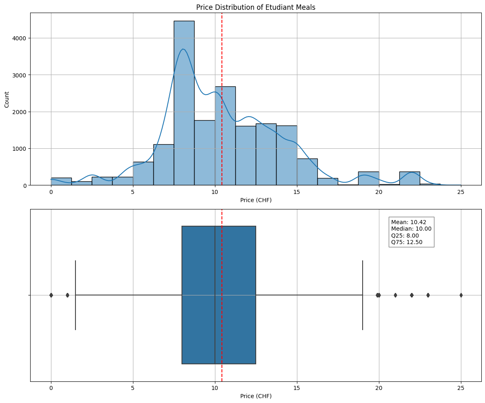
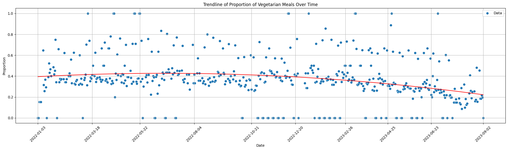

# :fork_and_knife: EPFL Restaurant Menu Analysis

[](https://opensource.org/licenses/MIT)

[](https://github.com/antoninfaure/epfl-miam/actions/workflows/pages/pages-build-deployment)

This project is a comprehensive solution for scraping, analyzing, and visualizing daily menus from EPFL campus restaurants. It utilizes web scraping techniques to extract menu information, including prices and vegetarian options, and offers tools for conducting exploratory data analysis (EDA). Additionally, it provides network analysis capabilities to uncover insights from meal names. Automation is achieved through GitHub Actions to ensure up-to-date menu data.

[Live Demo](https://antoninfaure.github.io/epfl-miam)

## Table of Contents

- [Prerequisites](#prerequisites)
- [Project Structure](#project-structure)
- [Scraping](#scraping)
- [Exploratory Data Analysis (EDA)](#exploratory-data-analysis-eda)
- [Network Building](#network-building)
- [GitHub Actions Workflow](#github-actions-workflow)
- [Contributing](#contributing)
- [License](#license)

## Prerequisites

Before getting started, ensure you have the required Python packages installed. You can do this with the following command:

```bash
pip install -r requirements.txt
```

## Project Structure

The project consists of several key components:

- `utils.py`: Python functions for scraping EPFL restaurant menus and saving them in a CSV file.

- :file_folder: `eda`: contains the Jupyter Notebook file for exploratory data analysis (EDA) of menu data.

- :file_folder: `network`: contains Python scripts and HTML/JavaScript files for network analysis of meal names.

- `cron.py`: script that runs daily to scrape the menu for the current date and appends it to the existing CSV file.

- `scrap_all.py`: script that scrapes menus between two specified dates and appends them to the CSV file.

- `.github/workflows/cron_scrap.yaml`: GitHub Actions workflow file that schedules the `cron.py` script to run daily at a specific time.

- `data/menus.csv`: CSV file where menu data is stored.

## Scraping

1. Clone this repository to your local machine.

2. Install the required Python packages:

   ```bash
   pip install -r requirements.txt
   ```

3. Run the `cron.py` script to scrape and update the menu for the current date:

   ```bash
   python cron.py
   ```

   This script will check if the menu for the current date is already in the CSV file. If not, it will scrape the menu and append it to the CSV file.

4. Additionally, you can run the `scrap_all.py` script to scrape menus between two dates (modify the `start_date` and `end_date` variables in the script):

   ```bash
   python scrap_all.py
   ```

   This script scrapes menus for all dates within the specified range and appends them to the CSV file if they are not already present.

## Exploratory Data Analysis (EDA)

The EDA folder contains the Jupyter Notebook file for performing exploratory data analysis on the menu data. You can use this notebook to gain insights into menu trends, pricing, and more.

Here are some results from the EDA notebook:




## Network Building

The network folder contains Python scripts and HTML/JavaScript files for analyzing meal names through network analysis.
The `network.py` script builds a network from the meal names in the CSV file. It outputs the following files:
- `edges.json`: contains the edges of the network.
- `vertices.json`: contains the vertices of the network.
- `bigrams.json`: contains the bigrams of the meal names.
The `network.js` script visualizes the network analysis results using [D3.js](https://d3js.org/). It is used by the `network.html` file, which displays the network visualization in a web browser.

You can see the live demo [here](https://antoninfaure.github.io/epfl-miam).

## GitHub Actions Workflow

This project includes a GitHub Actions workflow that automates the menu scraping process on a daily basis. The workflow is scheduled to run at 00:00 UTC (2:00 UTC+2) and can be adjusted in the `cron_scrap.yaml` file. It ensures that menu data is automatically updated every day without manual intervention. It also updates the network json files with the latest data.

When the workflow runs, it performs the following steps:

1. Checks out the repository content.

2. Sets up the Python environment and installs the required packages.

3. Executes the `cron.py` script to scrape and update the menu for the current date.

4. Executes the `network.py` script to build a network from the meal names in the CSV file.

5. Commits any changes made during the update to the GitHub repository.

6. Pushes the changes back to the repository, ensuring automatic daily updates of the menu data.

## Contributing

Contributions to this project are welcome. If you have suggestions, bug fixes, or improvements, please open an issue or create a pull request. For more details, check our [Contribution Guidelines](CONTRIBUTING.md).

## License

This project is licensed under the MIT License. See the [LICENSE](LICENSE) file for details.
